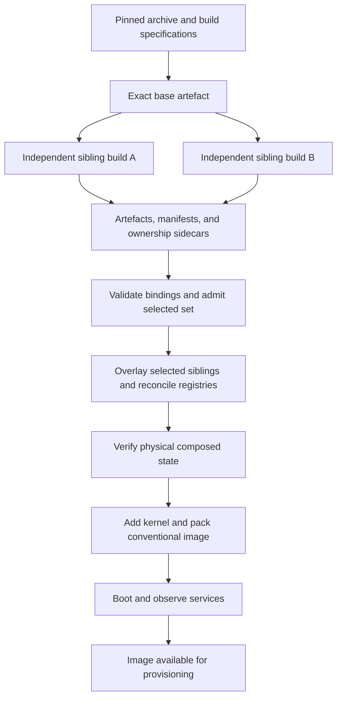

# 4 Design

## 4.1 Requirements and architectural constraints

ModFS addresses a repository that retains multiple Ubuntu workload images sharing a common operating-system base. Its objective is to store that base once, keep independently buildable package contributions, determine which selected contributions can coexist, and construct a conventional root for provisioning. This is a server-side assembly design. Nodes receive flattened images; they do not need a ModFS runtime or perform live module switching (`ARCHITECTURE.md` §§1–2, 13).

The primary measured generation uses Ubuntu 22.04, APT/dpkg, x86-64, OverlayFS, and SquashFS. Ubuntu 24.04 work tests portability of the procedure, but the current evidence catalogue and storage totals belong to the Jammy inventory (`thesis/evidence/catalogue.md`; `provenance.md`). A module can contain userspace packages and driver objects, while the bootable kernel image is added later during packing. Consequently the driver-to-kernel ABI remains a constraint even though the kernel is not a sibling.

The topology is deliberately flat. Every module is built directly against the same exact base, and compatible siblings share an archive snapshot, suite, architecture, and generation. Nested deltas would introduce dependencies on another module's build-time view and deletion semantics; a contribution relative to that parent could not simply be treated as a contribution relative to base. Restricting the topology makes those assumptions explicit rather than requiring an arbitrary layer graph to be rebased during assembly (`ARCHITECTURE.md` §§2–3).

Pinning constrains the repository universe available to APT. It does not prove that arbitrary module specifications choose identical versions, that maintainer scripts generate identical bytes, or that compatible packages provide compatible services. Explicit admission and physical checks remain necessary. The base is upgraded against the same pinned pockets before building siblings so bootstrap's initial package selection does not lag behind the dependency view used by a delta.

## 4.2 Pinned sibling model and invariants

Let B be an exact base artefact and M a selected set of deltas built against it. Each module contributes a package map P(m), removals R(m), captured filesystem changes, and extracted identity metadata. At the package-summary level, the effective installed state is described by

$$
P_{effective}(M)=\left(P(B)\cup\bigcup_{m\in M}P(m)\right)\setminus\bigcup_{m\in M}R(m).
$$

This is a union under compatibility conditions, not permission to overwrite contradictory versions in a dictionary. The admission checker rejects incompatible contributions before treating the expression as one package view. The removal term describes the metadata model; it does not claim that arbitrary file deletions and removal interactions have been validated. The current additive build policy and whiteout guard impose a narrower practical scope (`ARCHITECTURE.md` §§3, 5, 10).

| Invariant | Why it is needed | Enforcement or boundary |
|---|---|---|
| Exact common parent | The same parent name can refer to different bytes. | Generation identity includes the base digest. |
| Common archive view and platform | Independently resolved versions must refer to a compatible repository and architecture. | Snapshot, suite, architecture, and generation checks precede composition. |
| Metadata describes the stored artefact | A correct manifest for a discarded build tree says nothing about excluded archive content. | Extract from mounted artefacts and re-derive before trusting a catalogue. |
| File owners resolve to intended identities | Merging account names cannot repair numeric owners baked into files. | Allocate disjoint windows before install; check records and numeric owners afterwards. |
| Shared registries describe the selected union | OverlayFS picks one entire file at a shared path. | Semantic reconciliation and native-tool regeneration. |
| A failed composition is not published | A merger can write useful diagnostics before detecting an error. | Treat its nonzero result as rejection of the scratch tree. |
| Service coexistence is separately observed | File compatibility does not reserve runtime resources. | Boot probes, failed-unit records, and listener observations. |

Table 4.1: Design invariants. Sources: `ARCHITECTURE.md` §§2–6, 13 and `docs/DATA_MODEL.md`.

The generation identifier is derived from `(snapshot, suite, arch, base_sha256)`. Module specifications and module versions are excluded so a module may change within that generation. A changed base at the same snapshot is nevertheless a different generation. The identifier provides a checkable compatibility boundary; because it is an unkeyed digest stored with the bundle, it cannot authenticate an origin against deliberate replacement and resealing.

Figure 4.1: Architecture of a pinned sibling generation. Source: `ARCHITECTURE.md` §§2, 5–6, 13 and `docs/SAMPLING_AND_BOOT.md`. This is a mechanism schematic; no numerical measurement is represented. It describes the intended validation path, not a claim that every currently stored image has completed it.

## 4.3 Conflict taxonomy and policy

The conflict taxonomy separates mechanisms by the action they require. Some overlaps are harmless; some states must be rejected; others should be prevented before the bytes are created; shared registries need reconciliation; runtime resource contention needs execution. Table 4.2 follows the canonical taxonomy in `ARCHITECTURE.md` §4.

| Class | Mechanism | Policy |
|---|---|---|
| 1. Benign overlap | Siblings contribute the same package at the same version. | Accept at the package level and measure duplication. |
| 2. Version skew | Package versions or parent/snapshot/generation identities disagree. | Reject before mounting. |
| 3. Declared conflict | `Conflicts` or `Breaks`, including resolved virtual names, forbids coexistence. | Reject through package-relation checking. |
| 4. File collision | Different packages own one path without a sanctioned replacement or diversion. | Intersect ownership sidecars and reject unsanctioned overlap. |
| 5. State divergence | Independent installations rewrite complete shared registries. | Merge records or regenerate derived state. |
| 6. Implicit base upgrade | A delta upgrades a package inherited from base. | Upgrade base first at the pin and detect recurrence. |
| 7. Identity collision | Numeric owners and account identities disagree across siblings. | Partition allocation windows, merge records, and audit owners. |
| 8. Runtime resource conflict | Installed services compete for a runtime resource. | Observe at Tier 3; the earlier tiers do not model actual resource acquisition. |
| 9. Opaque directory erasure | A directory marker captured in one build hides another sibling's files. | Strip opaque markers under checked build preconditions; check visibility. |

### 4.3.1 Package compatibility and file ownership

Class 1 treats matching package identity as benign overlap for admission; it does not prove that post-install generated bytes match. Class 2 detects incompatible package versions and composability preconditions. Class 3 evaluates declared relations, including virtual names. A provided capability is not intrinsically exclusive: two providers without an explicit conflict are not rejected merely for providing the same name (`ARCHITECTURE.md` §5).

Module-level requirements are checked separately from Debian package relations. A selected CUDA module can require a selected driver module and an acceptable module version even if each was built alone against base. A set missing its driver may become acceptable when that driver is added. This is why a pairwise rejection is not automatically a permanent exclusion edge for a larger set. The current admission census demonstrates that distinction (`thesis/evidence/tier1.md` T1.4).

Class 4 needs the path-ownership sidecars, because package metadata alone does not enumerate every collision. Ownership intersection followed by replacement and diversion analysis has a direct predecessor in EDOS/Mancoosi [@treinen2008solving, §2.2.5]. `Replaces` and diversions require special treatment, but a declaration allowing dpkg to overwrite a path during sequential installation does not by itself reproduce those semantics in a static overlay. ModFS uses a conservative admission policy; complete replacement and diversion behavior remains a limit to the generality of the result (`ARCHITECTURE.md` §10; Chapter 5). A package-owned path index also cannot classify every inode attribute or unowned generated file.

### 4.3.2 Shared state and numeric identities

Class 5 is distinct from Class 4 because the affected paths are not owned by an individual package. Each delta can contain a full `/var/lib/dpkg/status` while OverlayFS shows only the highest copy. The payload files may all be visible even though dpkg forgets a lower module's installed packages. A path exception would merely stop reporting the overlap; only a semantic union repairs the database. The same reasoning applies to accounts, alternatives, debconf, diversions, and APT state (`docs/REGISTRY_FORMATS.md`).

The design uses the registry's meaning to choose its operation. Package stanzas have identity and version constraints; account membership and debconf owners are sets; manual APT intent dominates automatic marks. Alternative symlinks and the dynamic linker cache are derived outputs and are regenerated. This is not one generic text merge. Contradictory numeric identities or incompatible answers must be reported instead of silently resolved by whichever layer happens to win.

Class 7 also requires prevention. Package scripts in independent roots can allocate the same free number to different services. Once files are stored with that owner, merging names does not remap the inodes. Permanent allocation windows prevent ordinary builds from making the collision. Both allocator interfaces must be configured before installation, and account metadata and file-owner lists must be checked afterwards. Shared accounts supplied by base still require consistent identities. The final deployed allocation policy must also avoid reusing module IDs for future local users, an unresolved lifecycle concern (`ARCHITECTURE.md` §4).

### 4.3.3 Context-sensitive filesystem and runtime effects

Union-mount research already describes opaque-directory semantics and the sensitivity of deletion markers to layer order [@pendry1995union]. Class 9 arose because a captured filesystem operation has meaning relative to its lower layers. During a build, an opaque marker can hide only base entries. During composition, the same marker can hide a sibling that was absent when it was created. In the motivating case, `pyyaml` hid the `pytools` numpy tree without two packages claiming the same file path (`ARCHITECTURE.md` §3). A successful representation round trip through SquashFS therefore did not prove the desired sibling semantics.

The current build policy strips opaque markers only for direct-base siblings and rejects upperdirs containing whiteouts, a conservative guard against a deleting module whose directory-replacement intent could be destroyed. The storage format's ability to preserve whiteouts is not a validated arbitrary-removal workflow. V7 checks the resulting visible paths but still leaves equal-size content substitution outside its predicate.

Class 8 is the runtime boundary: `apache2` and `nginx` can be metadata-compatible and structurally complete while both seek port 80. Their actual startup outcome depends on scheduling. The existing Tier-1 and Tier-2 models cannot observe that race. A future policy could statically warn about known configured listeners, but would not turn an offline package or path check into an observation of resource acquisition. Runtime results are therefore recorded separately from structural success.

## 4.4 Verification as an architectural responsibility

The tiers trade coverage of the selected-set space against depth of observation. A metadata census can examine all pairs and triples without mounts. Physical composition inspects fewer larger sets because each trial mounts layers, reconciles, verifies, and tears down. Boot tests add kernel and service behavior at a still higher cost (`docs/SAMPLING_AND_BOOT.md`). A complete census of limited predicates and a deep test of a limited sample answer different questions.

The checker must declare what it has observed. Missing sidecars or malformed nested ownership fields cannot be treated as an empty, clean set of paths or owners. Where the checker returns `ACCEPT WITH WARNINGS`, that is weaker than fully checked acceptance. A negative control is likewise specific: an old-snapshot control exercises composability rejection, but does not establish that every account or debconf predicate is effective. Adversarial tests target the individual observation boundaries.

Trusted inputs are another design assumption. Packing and reconciliation invoke tools from composed roots with host-side privileges before the VM boundary. Bundle digests detect drift and internal inconsistency; they do not isolate hostile package code. The prototype therefore concerns a controlled build catalogue, not a service safely composing arbitrary untrusted customer artefacts (`ARCHITECTURE.md` §10, H12). This limit follows from where code executes, independently of whether its files have consistent hashes.

## 4.5 Updates, publication, and rollback

An intra-generation specification update rebuilds the affected sibling against the unchanged exact base, refreshes its manifest and sidecar, and repeats binding, admission, and relevant later checks. Rebuilding at a fixed snapshot cannot obtain a security version absent from that archive. A pin move instead builds a new base and all siblings in an isolated generation. The selected generation must be exposed coherently; the current implementation has no transactional remote publisher providing that atomicity (`ARCHITECTURE.md` §13).

Build work and transfer opportunity are separate. A byte-identical artefact could be reused from a content-addressed cache, while a changed hash requires the whole new archive under the current reporting model. An unchanged file size is not sufficient for reuse. No implemented remote client or block-difference protocol turns these byte comparisons into a measured network result.

The selected root is flattened into an ordinary image for delivery. Rollback means redeploying a retained complete bootable image and its configuration identity, or retaining every input needed to reconstruct that image. Base and deltas alone omit the packing-time kernel, initramfs, bootloader, and configuration. Operating-system rollback also does not undo application data or schema changes. These boundaries determine what Chapter 6 measures and why repository savings cannot be presented as per-node update or rollback performance.
